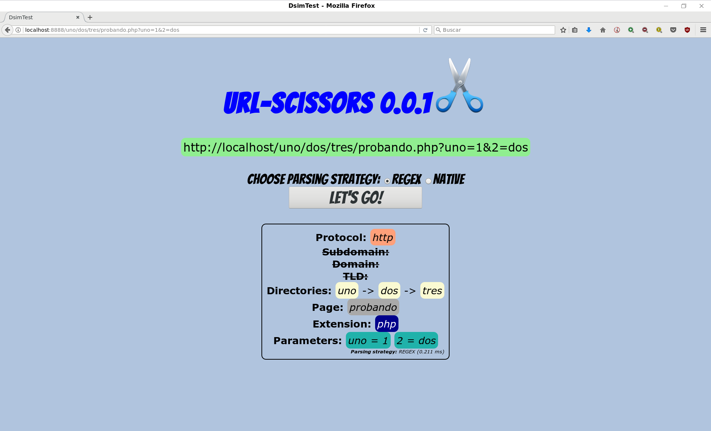

# DsimTest

For testing with PHP built-in web server:

`$ php composer.phar install`

`$ php -S localhost:8888 -t public public/index.php`

and click [here](http://localhost:8888/uno/dos/tres/probando.php?uno=1&2=dos)

**Unit tests:**

`$ ./vendor/bin/phpunit --colors=always ./tests/unit/`

**Behat tests:**

`$ ./vendor/bin/behat --config ./tests/behat/behat.yml ./tests/behat/features/parse.feature`

